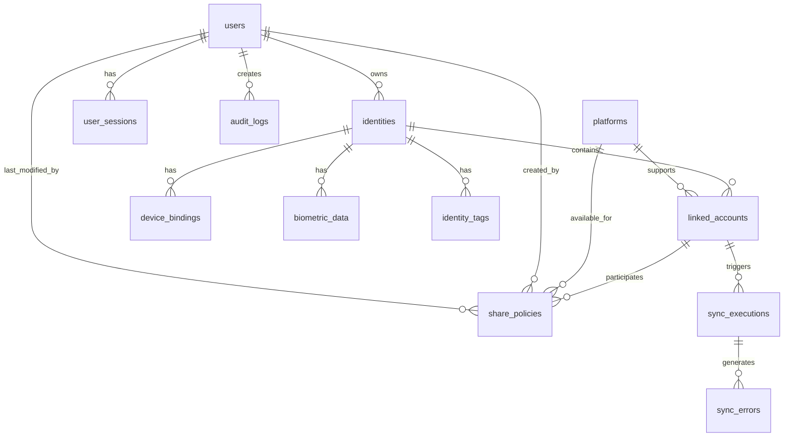

# AutoMePolit 数据库文档

## 目录
- [数据库概述](#数据库概述)
- [数据库设计原则](#数据库设计原则)
- [实体关系图](#实体关系图)
- [数据表结构](#数据表结构)
  - [用户与权限](#用户与权限)
  - [身份管理](#身份管理)
  - [账户关联](#账户关联)
  - [共享策略](#共享策略)
  - [系统配置](#系统配置)
- [索引设计](#索引设计)
- [数据迁移](#数据迁移)
- [性能优化](#性能优化)
- [数据备份与恢复](#数据备份与恢复)

## 数据库概述

### 基本信息
- **数据库类型**: MySQL 8.0+
- **字符集**: UTF8MB4
- **排序规则**: utf8mb4_unicode_ci
- **存储引擎**: InnoDB
- **连接池**: HikariCP

### 数据库配置
```properties
# 数据库连接配置
spring.datasource.url=jdbc:mysql://localhost:3306/auto_me_polit?useUnicode=true&characterEncoding=utf8mb4&useSSL=false&serverTimezone=Asia/Shanghai
spring.datasource.username=root
spring.datasource.password=root
spring.datasource.driver-class-name=com.mysql.cj.jdbc.Driver

# 连接池配置
spring.datasource.hikari.minimum-idle=5
spring.datasource.hikari.maximum-pool-size=15
spring.datasource.hikari.idle-timeout=600000
spring.datasource.hikari.max-lifetime=1800000
spring.datasource.hikari.connection-timeout=30000

# JPA配置
spring.jpa.hibernate.ddl-auto=validate
spring.jpa.show-sql=false
spring.jpa.properties.hibernate.dialect=org.hibernate.dialect.MySQL8Dialect
spring.jpa.properties.hibernate.format_sql=true
spring.jpa.properties.hibernate.use_sql_comments=true
```

## 数据库设计原则

### 命名规范
1. **表名**: 使用下划线命名法，复数形式 (如: `user_accounts`)
2. **字段名**: 使用下划线命名法 (如: `first_name`)
3. **主键**: 统一使用 `id`，类型为 `BIGINT`，自增
4. **外键**: 使用 `{entity}_id` 格式 (如: `user_id`)
5. **时间戳**: 创建时间使用 `created_at`，更新时间使用 `updated_at`

### 数据类型选择
1. **主键**: `BIGINT UNSIGNED AUTO_INCREMENT`
2. **状态字段**: `TINYINT`，使用枚举值
3. **布尔值**: `TINYINT(1)`，0表示false，1表示true
4. **大文本**: `TEXT` 或 `LONGTEXT`
5. **JSON数据**: `JSON` 类型 (MySQL 5.7+)
6. **时间**: `DATETIME`，时区UTC，程序层面处理时区转换

### 数据完整性
1. **主键约束**: 所有表必须有主键
2. **外键约束**: 关键关联关系建立外键约束
3. **唯一约束**: 需要唯一性的字段建立唯一索引
4. **非空约束**: 关键字段设置非空约束
5. **检查约束**: 使用触发器实现复杂的业务规则检查

## 实体关系图



## 数据表结构

## 用户与权限

### users (用户表)
存储系统用户基本信息。

```sql
CREATE TABLE `users` (
  `id` BIGINT UNSIGNED NOT NULL AUTO_INCREMENT COMMENT '用户ID',
  `username` VARCHAR(50) NOT NULL COMMENT '用户名',
  `email` VARCHAR(100) NOT NULL COMMENT '邮箱',
  `password_hash` VARCHAR(255) NOT NULL COMMENT '密码哈希',
  `salt` VARCHAR(32) NOT NULL COMMENT '密码盐值',
  `first_name` VARCHAR(50) DEFAULT NULL COMMENT '名字',
  `last_name` VARCHAR(50) DEFAULT NULL COMMENT '姓氏',
  `phone` VARCHAR(20) DEFAULT NULL COMMENT '手机号',
  `avatar` VARCHAR(500) DEFAULT NULL COMMENT '头像URL',
  `status` TINYINT NOT NULL DEFAULT 1 COMMENT '状态：0-禁用，1-启用',
  `email_verified` TINYINT(1) NOT NULL DEFAULT 0 COMMENT '邮箱是否验证',
  `phone_verified` TINYINT(1) NOT NULL DEFAULT 0 COMMENT '手机是否验证',
  `two_factor_enabled` TINYINT(1) NOT NULL DEFAULT 0 COMMENT '是否启用双因子认证',
  `last_login_at` DATETIME DEFAULT NULL COMMENT '最后登录时间',
  `last_login_ip` VARCHAR(45) DEFAULT NULL COMMENT '最后登录IP',
  `password_expired_at` DATETIME DEFAULT NULL COMMENT '密码过期时间',
  `created_at` DATETIME NOT NULL DEFAULT CURRENT_TIMESTAMP COMMENT '创建时间',
  `updated_at` DATETIME NOT NULL DEFAULT CURRENT_TIMESTAMP ON UPDATE CURRENT_TIMESTAMP COMMENT '更新时间',
  PRIMARY KEY (`id`),
  UNIQUE KEY `uk_username` (`username`),
  UNIQUE KEY `uk_email` (`email`),
  KEY `idx_status` (`status`),
  KEY `idx_created_at` (`created_at`)
) ENGINE=InnoDB DEFAULT CHARSET=utf8mb4 COLLATE=utf8mb4_unicode_ci COMMENT='用户表';
```

### user_sessions (用户会话表)
存储用户登录会话信息，用于会话管理和JWT刷新。

```sql
CREATE TABLE `user_sessions` (
  `id` BIGINT UNSIGNED NOT NULL AUTO_INCREMENT COMMENT '会话ID',
  `user_id` BIGINT UNSIGNED NOT NULL COMMENT '用户ID',
  `session_token` VARCHAR(255) NOT NULL COMMENT '会话令牌',
  `refresh_token` VARCHAR(255) NOT NULL COMMENT '刷新令牌',
  `device_info` JSON DEFAULT NULL COMMENT '设备信息',
  `ip_address` VARCHAR(45) DEFAULT NULL COMMENT 'IP地址',
  `user_agent` TEXT DEFAULT NULL COMMENT '用户代理',
  `expires_at` DATETIME NOT NULL COMMENT '过期时间',
  `created_at` DATETIME NOT NULL DEFAULT CURRENT_TIMESTAMP COMMENT '创建时间',
  `updated_at` DATETIME NOT NULL DEFAULT CURRENT_TIMESTAMP ON UPDATE CURRENT_TIMESTAMP COMMENT '更新时间',
  PRIMARY KEY (`id`),
  UNIQUE KEY `uk_session_token` (`session_token`),
  UNIQUE KEY `uk_refresh_token` (`refresh_token`),
  KEY `fk_user_sessions_user_id` (`user_id`),
  KEY `idx_expires_at` (`expires_at`),
  CONSTRAINT `fk_user_sessions_user_id` FOREIGN KEY (`user_id`) REFERENCES `users` (`id`) ON DELETE CASCADE
) ENGINE=InnoDB DEFAULT CHARSET=utf8mb4 COLLATE=utf8mb4_unicode_ci COMMENT='用户会话表';
```

### audit_logs (审计日志表)
记录系统操作审计日志。

```sql
CREATE TABLE `audit_logs` (
  `id` BIGINT UNSIGNED NOT NULL AUTO_INCREMENT COMMENT '日志ID',
  `user_id` BIGINT UNSIGNED DEFAULT NULL COMMENT '操作用户ID',
  `action` VARCHAR(100) NOT NULL COMMENT '操作动作',
  `resource_type` VARCHAR(50) NOT NULL COMMENT '资源类型',
  `resource_id` VARCHAR(100) DEFAULT NULL COMMENT '资源ID',
  `details` JSON DEFAULT NULL COMMENT '详细信息',
  `ip_address` VARCHAR(45) DEFAULT NULL COMMENT 'IP地址',
  `user_agent` TEXT DEFAULT NULL COMMENT '用户代理',
  `status` TINYINT NOT NULL DEFAULT 1 COMMENT '操作状态：0-失败，1-成功',
  `error_message` TEXT DEFAULT NULL COMMENT '错误信息',
  `created_at` DATETIME NOT NULL DEFAULT CURRENT_TIMESTAMP COMMENT '创建时间',
  PRIMARY KEY (`id`),
  KEY `fk_audit_logs_user_id` (`user_id`),
  KEY `idx_action` (`action`),
  KEY `idx_resource_type` (`resource_type`),
  KEY `idx_created_at` (`created_at`),
  CONSTRAINT `fk_audit_logs_user_id` FOREIGN KEY (`user_id`) REFERENCES `users` (`id`) ON DELETE SET NULL
) ENGINE=InnoDB DEFAULT CHARSET=utf8mb4 COLLATE=utf8mb4_unicode_ci COMMENT='审计日志表';
```

## 身份管理

### identities (身份表)
存储用户创建的各种身份信息。

```sql
CREATE TABLE `identities` (
  `id` BIGINT UNSIGNED NOT NULL AUTO_INCREMENT COMMENT '身份ID',
  `user_id` BIGINT UNSIGNED NOT NULL COMMENT '所属用户ID',
  `name` VARCHAR(100) NOT NULL COMMENT '身份名称',
  `description` TEXT DEFAULT NULL COMMENT '身份描述',
  `platform` VARCHAR(50) NOT NULL COMMENT '平台类型',
  `status` TINYINT NOT NULL DEFAULT 1 COMMENT '状态：0-禁用，1-启用',
  `avatar` VARCHAR(500) DEFAULT NULL COMMENT '头像URL',
  `is_primary` TINYINT(1) NOT NULL DEFAULT 0 COMMENT '是否为主要身份',
  `metadata` JSON DEFAULT NULL COMMENT '元数据',
  `created_at` DATETIME NOT NULL DEFAULT CURRENT_TIMESTAMP COMMENT '创建时间',
  `updated_at` DATETIME NOT NULL DEFAULT CURRENT_TIMESTAMP ON UPDATE CURRENT_TIMESTAMP COMMENT '更新时间',
  PRIMARY KEY (`id`),
  KEY `fk_identities_user_id` (`user_id`),
  KEY `idx_platform` (`platform`),
  KEY `idx_status` (`status`),
  KEY `idx_user_platform` (`user_id`, `platform`),
  CONSTRAINT `fk_identities_user_id` FOREIGN KEY (`user_id`) REFERENCES `users` (`id`) ON DELETE CASCADE
) ENGINE=InnoDB DEFAULT CHARSET=utf8mb4 COLLATE=utf8mb4_unicode_ci COMMENT='身份表';
```

### device_bindings (设备绑定表)
存储身份与设备的绑定关系。

```sql
CREATE TABLE `device_bindings` (
  `id` BIGINT UNSIGNED NOT NULL AUTO_INCREMENT COMMENT '绑定ID',
  `identity_id` BIGINT UNSIGNED NOT NULL COMMENT '身份ID',
  `device_id` VARCHAR(100) NOT NULL COMMENT '设备ID',
  `device_name` VARCHAR(100) DEFAULT NULL COMMENT '设备名称',
  `device_type` VARCHAR(50) DEFAULT NULL COMMENT '设备类型',
  `device_info` JSON DEFAULT NULL COMMENT '设备详细信息',
  `last_login_at` DATETIME DEFAULT NULL COMMENT '最后登录时间',
  `is_trusted` TINYINT(1) NOT NULL DEFAULT 0 COMMENT '是否受信任设备',
  `created_at` DATETIME NOT NULL DEFAULT CURRENT_TIMESTAMP COMMENT '创建时间',
  `updated_at` DATETIME NOT NULL DEFAULT CURRENT_TIMESTAMP ON UPDATE CURRENT_TIMESTAMP COMMENT '更新时间',
  PRIMARY KEY (`id`),
  UNIQUE KEY `uk_identity_device` (`identity_id`, `device_id`),
  KEY `fk_device_bindings_identity_id` (`identity_id`),
  KEY `idx_device_type` (`device_type`),
  CONSTRAINT `fk_device_bindings_identity_id` FOREIGN KEY (`identity_id`) REFERENCES `identities` (`id`) ON DELETE CASCADE
) ENGINE=InnoDB DEFAULT CHARSET=utf8mb4 COLLATE=utf8mb4_unicode_ci COMMENT='设备绑定表';
```

### biometric_data (生物特征数据表)
存储生物特征认证相关数据。

```sql
CREATE TABLE `biometric_data` (
  `id` BIGINT UNSIGNED NOT NULL AUTO_INCREMENT COMMENT '数据ID',
  `identity_id` BIGINT UNSIGNED NOT NULL COMMENT '身份ID',
  `fingerprint` TINYINT(1) NOT NULL DEFAULT 0 COMMENT '指纹识别',
  `face_id` TINYINT(1) NOT NULL DEFAULT 0 COMMENT '面部识别',
  `voice_id` TINYINT(1) NOT NULL DEFAULT 0 COMMENT '语音识别',
  `iris_scan` TINYINT(1) NOT NULL DEFAULT 0 COMMENT '虹膜扫描',
  `palm_print` TINYINT(1) NOT NULL DEFAULT 0 COMMENT '掌纹识别',
  `biometric_templates` JSON DEFAULT NULL COMMENT '生物特征模板数据',
  `encrypted` TINYINT(1) NOT NULL DEFAULT 1 COMMENT '是否加密存储',
  `created_at` DATETIME NOT NULL DEFAULT CURRENT_TIMESTAMP COMMENT '创建时间',
  `updated_at` DATETIME NOT NULL DEFAULT CURRENT_TIMESTAMP ON UPDATE CURRENT_TIMESTAMP COMMENT '更新时间',
  PRIMARY KEY (`id`),
  UNIQUE KEY `uk_identity_biometric` (`identity_id`),
  KEY `fk_biometric_data_identity_id` (`identity_id`),
  CONSTRAINT `fk_biometric_data_identity_id` FOREIGN KEY (`identity_id`) REFERENCES `identities` (`id`) ON DELETE CASCADE
) ENGINE=InnoDB DEFAULT CHARSET=utf8mb4 COLLATE=utf8mb4_unicode_ci COMMENT='生物特征数据表';
```

### identity_tags (身份标签表)
为身份添加标签进行分类管理。

```sql
CREATE TABLE `identity_tags` (
  `id` BIGINT UNSIGNED NOT NULL AUTO_INCREMENT COMMENT '标签ID',
  `identity_id` BIGINT UNSIGNED NOT NULL COMMENT '身份ID',
  `tag_name` VARCHAR(50) NOT NULL COMMENT '标签名称',
  `tag_color` VARCHAR(7) DEFAULT NULL COMMENT '标签颜色',
  `created_at` DATETIME NOT NULL DEFAULT CURRENT_TIMESTAMP COMMENT '创建时间',
  PRIMARY KEY (`id`),
  KEY `fk_identity_tags_identity_id` (`identity_id`),
  KEY `idx_tag_name` (`tag_name`),
  CONSTRAINT `fk_identity_tags_identity_id` FOREIGN KEY (`identity_id`) REFERENCES `identities` (`id`) ON DELETE CASCADE
) ENGINE=InnoDB DEFAULT CHARSET=utf8mb4 COLLATE=utf8mb4_unicode_ci COMMENT='身份标签表';
```

## 账户关联

### platforms (平台配置表)
存储支持的第三方平台配置信息。

```sql
CREATE TABLE `platforms` (
  `id` BIGINT UNSIGNED NOT NULL AUTO_INCREMENT COMMENT '平台ID',
  `name` VARCHAR(50) NOT NULL COMMENT '平台名称',
  `display_name` VARCHAR(100) NOT NULL COMMENT '显示名称',
  `icon` VARCHAR(500) DEFAULT NULL COMMENT '图标URL',
  `api_endpoint` VARCHAR(255) NOT NULL COMMENT 'API端点',
  `auth_type` VARCHAR(20) NOT NULL DEFAULT 'oauth2' COMMENT '认证类型',
  `auth_config` JSON NOT NULL COMMENT '认证配置',
  `supported_data_types` JSON NOT NULL COMMENT '支持的数据类型',
  `sync_capabilities` JSON NOT NULL COMMENT '同步能力',
  `rate_limits` JSON DEFAULT NULL COMMENT '频率限制',
  `is_active` TINYINT(1) NOT NULL DEFAULT 1 COMMENT '是否启用',
  `version` VARCHAR(20) NOT NULL DEFAULT '1.0.0' COMMENT '版本',
  `created_at` DATETIME NOT NULL DEFAULT CURRENT_TIMESTAMP COMMENT '创建时间',
  `updated_at` DATETIME NOT NULL DEFAULT CURRENT_TIMESTAMP ON UPDATE CURRENT_TIMESTAMP COMMENT '更新时间',
  PRIMARY KEY (`id`),
  UNIQUE KEY `uk_name` (`name`),
  KEY `idx_is_active` (`is_active`)
) ENGINE=InnoDB DEFAULT CHARSET=utf8mb4 COLLATE=utf8mb4_unicode_ci COMMENT='平台配置表';
```

### linked_accounts (关联账户表)
存储身份与第三方平台的关联账户信息。

```sql
CREATE TABLE `linked_accounts` (
  `id` BIGINT UNSIGNED NOT NULL AUTO_INCREMENT COMMENT '关联ID',
  `identity_id` BIGINT UNSIGNED NOT NULL COMMENT '身份ID',
  `platform_id` BIGINT UNSIGNED NOT NULL COMMENT '平台ID',
  `platform_user_id` VARCHAR(255) NOT NULL COMMENT '平台用户ID',
  `name` VARCHAR(100) DEFAULT NULL COMMENT '账户名称',
  `nickname` VARCHAR(100) DEFAULT NULL COMMENT '昵称',
  `email` VARCHAR(255) DEFAULT NULL COMMENT '关联邮箱',
  `avatar` VARCHAR(500) DEFAULT NULL COMMENT '头像URL',
  `gender` TINYINT DEFAULT NULL COMMENT '性别：0-未知，1-男，2-女',
  `birthday` DATE DEFAULT NULL COMMENT '生日',
  `location` VARCHAR(100) DEFAULT NULL COMMENT '地理位置',
  `bio` TEXT DEFAULT NULL COMMENT '个人简介',
  `status` TINYINT NOT NULL DEFAULT 1 COMMENT '状态：0-失效，1-正常，2-待验证',
  `is_verified` TINYINT(1) NOT NULL DEFAULT 0 COMMENT '是否已验证',
  `last_login_at` DATETIME DEFAULT NULL COMMENT '最后登录时间',
  `last_sync_at` DATETIME DEFAULT NULL COMMENT '最后同步时间',
  `access_token` TEXT DEFAULT NULL COMMENT '访问令牌',
  `refresh_token` TEXT DEFAULT NULL COMMENT '刷新令牌',
  `token_expires_at` DATETIME DEFAULT NULL COMMENT '令牌过期时间',
  `sync_config` JSON DEFAULT NULL COMMENT '同步配置',
  `metadata` JSON DEFAULT NULL COMMENT '额外元数据',
  `created_at` DATETIME NOT NULL DEFAULT CURRENT_TIMESTAMP COMMENT '创建时间',
  `updated_at` DATETIME NOT NULL DEFAULT CURRENT_TIMESTAMP ON UPDATE CURRENT_TIMESTAMP COMMENT '更新时间',
  PRIMARY KEY (`id`),
  UNIQUE KEY `uk_identity_platform` (`identity_id`, `platform_id`),
  UNIQUE KEY `uk_platform_user` (`platform_id`, `platform_user_id`),
  KEY `fk_linked_accounts_identity_id` (`identity_id`),
  KEY `fk_linked_accounts_platform_id` (`platform_id`),
  KEY `idx_status` (`status`),
  KEY `idx_last_sync_at` (`last_sync_at`),
  CONSTRAINT `fk_linked_accounts_identity_id` FOREIGN KEY (`identity_id`) REFERENCES `identities` (`id`) ON DELETE CASCADE,
  CONSTRAINT `fk_linked_accounts_platform_id` FOREIGN KEY (`platform_id`) REFERENCES `platforms` (`id`) ON DELETE RESTRICT
) ENGINE=InnoDB DEFAULT CHARSET=utf8mb4 COLLATE=utf8mb4_unicode_ci COMMENT='关联账户表';
```

## 共享策略

### share_policies (共享策略表)
定义身份间的数据共享策略。

```sql
CREATE TABLE `share_policies` (
  `id` BIGINT UNSIGNED NOT NULL AUTO_INCREMENT COMMENT '策略ID',
  `name` VARCHAR(100) NOT NULL COMMENT '策略名称',
  `description` TEXT DEFAULT NULL COMMENT '策略描述',
  `type` VARCHAR(20) NOT NULL COMMENT '策略类型：sync-同步，share-共享，backup-备份，migration-迁移',
  `source_account_id` BIGINT UNSIGNED NOT NULL COMMENT '源账户ID',
  `target_account_id` BIGINT UNSIGNED NOT NULL COMMENT '目标账户ID',
  `status` TINYINT NOT NULL DEFAULT 1 COMMENT '状态：0-禁用，1-启用，2-暂停',
  `config` JSON NOT NULL COMMENT '策略配置',
  `execution_frequency` VARCHAR(50) NOT NULL DEFAULT 'manual' COMMENT '执行频率',
  `last_execution_at` DATETIME DEFAULT NULL COMMENT '最后执行时间',
  `next_execution_at` DATETIME DEFAULT NULL COMMENT '下次执行时间',
  `execution_count` INT UNSIGNED NOT NULL DEFAULT 0 COMMENT '执行次数',
  `success_count` INT UNSIGNED NOT NULL DEFAULT 0 COMMENT '成功次数',
  `error_count` INT UNSIGNED NOT NULL DEFAULT 0 COMMENT '失败次数',
  `created_by` BIGINT UNSIGNED NOT NULL COMMENT '创建者ID',
  `last_modified_by` BIGINT UNSIGNED DEFAULT NULL COMMENT '最后修改者ID',
  `created_at` DATETIME NOT NULL DEFAULT CURRENT_TIMESTAMP COMMENT '创建时间',
  `updated_at` DATETIME NOT NULL DEFAULT CURRENT_TIMESTAMP ON UPDATE CURRENT_TIMESTAMP COMMENT '更新时间',
  PRIMARY KEY (`id`),
  KEY `fk_share_policies_created_by` (`created_by`),
  KEY `fk_share_policies_last_modified_by` (`last_modified_by`),
  KEY `fk_share_policies_source_account_id` (`source_account_id`),
  KEY `fk_share_policies_target_account_id` (`target_account_id`),
  KEY `idx_type` (`type`),
  KEY `idx_status` (`status`),
  KEY `idx_next_execution_at` (`next_execution_at`),
  CONSTRAINT `fk_share_policies_created_by` FOREIGN KEY (`created_by`) REFERENCES `users` (`id`) ON DELETE RESTRICT,
  CONSTRAINT `fk_share_policies_last_modified_by` FOREIGN KEY (`last_modified_by`) REFERENCES `users` (`id`) ON DELETE SET NULL,
  CONSTRAINT `fk_share_policies_source_account_id` FOREIGN KEY (`source_account_id`) REFERENCES `linked_accounts` (`id`) ON DELETE CASCADE,
  CONSTRAINT `fk_share_policies_target_account_id` FOREIGN KEY (`target_account_id`) REFERENCES `linked_accounts` (`id`) ON DELETE CASCADE
) ENGINE=InnoDB DEFAULT CHARSET=utf8mb4 COLLATE=utf8mb4_unicode_ci COMMENT='共享策略表';
```

### sync_executions (同步执行记录表)
记录策略执行的历史记录。

```sql
CREATE TABLE `sync_executions` (
  `id` BIGINT UNSIGNED NOT NULL AUTO_INCREMENT COMMENT '执行ID',
  `policy_id` BIGINT UNSIGNED NOT NULL COMMENT '策略ID',
  `execution_type` VARCHAR(20) NOT NULL DEFAULT 'scheduled' COMMENT '执行类型：scheduled-定时，manual-手动，trigger-触发',
  `status` VARCHAR(20) NOT NULL DEFAULT 'pending' COMMENT '状态：pending-等待，running-运行中，success-成功，failed-失败，cancelled-取消',
  `started_at` DATETIME DEFAULT NULL COMMENT '开始时间',
  `ended_at` DATETIME DEFAULT NULL COMMENT '结束时间',
  `duration` INT UNSIGNED DEFAULT NULL COMMENT '执行时长（秒）',
  `trigger_type` VARCHAR(20) DEFAULT NULL COMMENT '触发类型：scheduled，manual，webhook',
  `trigger_data` JSON DEFAULT NULL COMMENT '触发数据',
  `sync_types` JSON DEFAULT NULL COMMENT '同步类型',
  `data_count` INT UNSIGNED DEFAULT NULL COMMENT '处理数据数量',
  `success_count` INT UNSIGNED DEFAULT NULL COMMENT '成功数量',
  `error_count` INT UNSIGNED DEFAULT NULL COMMENT '错误数量',
  `result_summary` JSON DEFAULT NULL COMMENT '结果摘要',
  `error_message` TEXT DEFAULT NULL COMMENT '错误信息',
  `executed_by` BIGINT UNSIGNED DEFAULT NULL COMMENT '执行者ID',
  `created_at` DATETIME NOT NULL DEFAULT CURRENT_TIMESTAMP COMMENT '创建时间',
  PRIMARY KEY (`id`),
  KEY `fk_sync_executions_policy_id` (`policy_id`),
  KEY `fk_sync_executions_executed_by` (`executed_by`),
  KEY `idx_status` (`status`),
  KEY `idx_started_at` (`started_at`),
  KEY `idx_execution_type` (`execution_type`),
  CONSTRAINT `fk_sync_executions_policy_id` FOREIGN KEY (`policy_id`) REFERENCES `share_policies` (`id`) ON DELETE CASCADE,
  CONSTRAINT `fk_sync_executions_executed_by` FOREIGN KEY (`executed_by`) REFERENCES `users` (`id`) ON DELETE SET NULL
) ENGINE=InnoDB DEFAULT CHARSET=utf8mb4 COLLATE=utf8mb4_unicode_ci COMMENT='同步执行记录表';
```

### sync_errors (同步错误详情表)
记录同步过程中的具体错误信息。

```sql
CREATE TABLE `sync_errors` (
  `id` BIGINT UNSIGNED NOT NULL AUTO_INCREMENT COMMENT '错误ID',
  `execution_id` BIGINT UNSIGNED NOT NULL COMMENT '执行ID',
  `error_code` VARCHAR(50) DEFAULT NULL COMMENT '错误代码',
  `error_message` TEXT NOT NULL COMMENT '错误信息',
  `error_details` JSON DEFAULT NULL COMMENT '错误详情',
  `data_type` VARCHAR(50) DEFAULT NULL COMMENT '数据类型',
  `data_id` VARCHAR(255) DEFAULT NULL COMMENT '数据ID',
  `retry_count` INT UNSIGNED NOT NULL DEFAULT 0 COMMENT '重试次数',
  `resolved` TINYINT(1) NOT NULL DEFAULT 0 COMMENT '是否已解决',
  `resolved_at` DATETIME DEFAULT NULL COMMENT '解决时间',
  `resolved_by` BIGINT UNSIGNED DEFAULT NULL COMMENT '解决者ID',
  `created_at` DATETIME NOT NULL DEFAULT CURRENT_TIMESTAMP COMMENT '创建时间',
  PRIMARY KEY (`id`),
  KEY `fk_sync_errors_execution_id` (`execution_id`),
  KEY `fk_sync_errors_resolved_by` (`resolved_by`),
  KEY `idx_error_code` (`error_code`),
  KEY `idx_data_type` (`data_type`),
  KEY `idx_resolved` (`resolved`),
  CONSTRAINT `fk_sync_errors_execution_id` FOREIGN KEY (`execution_id`) REFERENCES `sync_executions` (`id`) ON DELETE CASCADE,
  CONSTRAINT `fk_sync_errors_resolved_by` FOREIGN KEY (`resolved_by`) REFERENCES `users` (`id`) ON DELETE SET NULL
) ENGINE=InnoDB DEFAULT CHARSET=utf8mb4 COLLATE=utf8mb4_unicode_ci COMMENT='同步错误详情表';
```

## 系统配置

### system_configs (系统配置表)
存储系统全局配置信息。

```sql
CREATE TABLE `system_configs` (
  `id` BIGINT UNSIGNED NOT NULL AUTO_INCREMENT COMMENT '配置ID',
  `config_key` VARCHAR(100) NOT NULL COMMENT '配置键',
  `config_value` LONGTEXT NOT NULL COMMENT '配置值',
  `config_type` VARCHAR(20) NOT NULL DEFAULT 'string' COMMENT '配置类型：string，integer，boolean，json',
  `description` TEXT DEFAULT NULL COMMENT '配置描述',
  `is_encrypted` TINYINT(1) NOT NULL DEFAULT 0 COMMENT '是否加密存储',
  `is_public` TINYINT(1) NOT NULL DEFAULT 0 COMMENT '是否公开配置',
  `updated_by` BIGINT UNSIGNED DEFAULT NULL COMMENT '更新者ID',
  `created_at` DATETIME NOT NULL DEFAULT CURRENT_TIMESTAMP COMMENT '创建时间',
  `updated_at` DATETIME NOT NULL DEFAULT CURRENT_TIMESTAMP ON UPDATE CURRENT_TIMESTAMP COMMENT '更新时间',
  PRIMARY KEY (`id`),
  UNIQUE KEY `uk_config_key` (`config_key`),
  KEY `fk_system_configs_updated_by` (`updated_by`),
  KEY `idx_is_public` (`is_public`)
) ENGINE=InnoDB DEFAULT CHARSET=utf8mb4 COLLATE=utf8mb4_unicode_ci COMMENT='系统配置表';
```

### notification_templates (通知模板表)
存储系统通知模板配置。

```sql
CREATE TABLE `notification_templates` (
  `id` BIGINT UNSIGNED NOT NULL AUTO_INCREMENT COMMENT '模板ID',
  `template_key` VARCHAR(100) NOT NULL COMMENT '模板键',
  `template_name` VARCHAR(100) NOT NULL COMMENT '模板名称',
  `template_type` VARCHAR(20) NOT NULL COMMENT '模板类型：email，sms，push，webhook',
  `subject` VARCHAR(255) DEFAULT NULL COMMENT '主题',
  `content` LONGTEXT NOT NULL COMMENT '内容',
  `variables` JSON DEFAULT NULL COMMENT '变量定义',
  `is_active` TINYINT(1) NOT NULL DEFAULT 1 COMMENT '是否启用',
  `updated_by` BIGINT UNSIGNED DEFAULT NULL COMMENT '更新者ID',
  `created_at` DATETIME NOT NULL DEFAULT CURRENT_TIMESTAMP COMMENT '创建时间',
  `updated_at` DATETIME NOT NULL DEFAULT CURRENT_TIMESTAMP ON UPDATE CURRENT_TIMESTAMP COMMENT '更新时间',
  PRIMARY KEY (`id`),
  UNIQUE KEY `uk_template_key` (`template_key`),
  KEY `fk_notification_templates_updated_by` (`updated_by`),
  KEY `idx_template_type` (`template_type`),
  KEY `idx_is_active` (`is_active`),
  CONSTRAINT `fk_notification_templates_updated_by` FOREIGN KEY (`updated_by`) REFERENCES `users` (`id`) ON DELETE SET NULL
) ENGINE=InnoDB DEFAULT CHARSET=utf8mb4 COLLATE=utf8mb4_unicode_ci COMMENT='通知模板表';
```

## 索引设计

### 主键索引
所有表都定义了自动递增的主键索引。

### 唯一索引
- `users.username`: 保证用户名唯一
- `users.email`: 保证邮箱唯一
- `user_sessions.session_token`: 保证会话令牌唯一
- `user_sessions.refresh_token`: 保证刷新令牌唯一
- `identities.user_id, identities.platform_id`: 保证同一用户同一平台的身份唯一
- `device_bindings.identity_id, device_bindings.device_id`: 保证设备绑定关系唯一
- `linked_accounts.platform_id, linked_accounts.platform_user_id`: 保证平台用户唯一
- `system_configs.config_key`: 保证配置键唯一
- `notification_templates.template_key`: 保证模板键唯一

### 复合索引
- `identities.user_id, identities.platform`: 查询用户特定平台的身份
- `linked_accounts.status, linked_accounts.last_sync_at`: 查询需要同步的账户
- `share_policies.status, share_policies.next_execution_at`: 查询需要执行的任务

### 普通索引
为所有外键字段、状态字段、时间字段创建索引以提高查询性能。

## 数据迁移

### 数据库初始化脚本
```sql
-- 创建数据库
CREATE DATABASE IF NOT EXISTS auto_me_polit 
CHARACTER SET utf8mb4 
COLLATE utf8mb4_unicode_ci;

-- 使用数据库
USE auto_me_polit;

-- 创建所有表（参见上面的表结构定义）

-- 插入初始数据
-- 插入平台配置
INSERT INTO `platforms` (`name`, `display_name`, `api_endpoint`, `auth_type`, `auth_config`, `supported_data_types`, `sync_capabilities`) VALUES
('wechat', '微信', 'https://api.weixin.qq.com', 'oauth2', '{"client_id":"xxx","client_secret":"xxx","authorize_url":"https://open.weixin.qq.com/connect/oauth2/authorize","token_url":"https://api.weixin.qq.com/sns/oauth2/access_token"}', '["profile","contacts","groups","messages"]', '{"realtime":true,"scheduled":true,"bidirectional":false}'),
('alipay', '支付宝', 'https://openapi.alipay.com', 'oauth2', '{"client_id":"xxx","client_secret":"xxx","authorize_url":"https://openauth.alipay.com/oauth2/authorize","token_url":"https://openapi.alipay.com/gateway.do"}', '["profile","contacts","transactions"]', '{"realtime":true,"scheduled":true,"bidirectional":false}'),
('weibo', '微博', 'https://api.weibo.com', 'oauth2', '{"client_id":"xxx","client_secret":"xxx","authorize_url":"https://api.weibo.com/oauth2/authorize","token_url":"https://api.weibo.com/oauth2/access_token"}', '["profile","contacts","posts","followers"]', '{"realtime":true,"scheduled":true,"bidirectional":false}');

-- 插入通知模板
INSERT INTO `notification_templates` (`template_key`, `template_name`, `template_type`, `subject`, `content`, `variables`) VALUES
('policy_execution_success', '策略执行成功通知', 'email', '策略执行成功', '策略 {{policy_name}} 已成功执行，处理了 {{data_count}} 条数据。', '{"policy_name":"策略名称","data_count":"数据数量"}'),
('policy_execution_failed', '策略执行失败通知', 'email', '策略执行失败', '策略 {{policy_name}} 执行失败，错误信息：{{error_message}}', '{"policy_name":"策略名称","error_message":"错误信息"}'),
('account_linked', '账户关联成功通知', 'email', '账户关联成功', '您的身份 {{identity_name}} 已成功关联到 {{platform_name}} 账户 {{account_name}}。', '{"identity_name":"身份名称","platform_name":"平台名称","account_name":"账户名称"}');

-- 插入系统配置
INSERT INTO `system_configs` (`config_key`, `config_value`, `config_type`, `description`, `is_public`) VALUES
('app.name', 'AutoMePolit', 'string', '应用名称', 1),
('app.version', '1.0.0', 'string', '应用版本', 1),
('app.maintenance', 'false', 'boolean', '维护模式', 1),
('sync.max_retry_count', '3', 'integer', '同步最大重试次数', 0),
('sync.default_interval', '3600', 'integer', '默认同步间隔（秒）', 0),
('notification.enabled', 'true', 'boolean', '是否启用通知', 0),
('security.password_min_length', '8', 'integer', '密码最小长度', 0),
('security.session_timeout', '1800', 'integer', '会话超时时间（秒）', 0);
```

### 数据迁移脚本示例
```sql
-- 示例：将 identities 表的 is_primary 字段默认值从 0 改为 1
ALTER TABLE `identities` MODIFY COLUMN `is_primary` TINYINT(1) NOT NULL DEFAULT 1 COMMENT '是否为主要身份';

-- 示例：添加新字段
ALTER TABLE `users` ADD COLUMN `last_activity_at` DATETIME DEFAULT NULL COMMENT '最后活动时间';

-- 示例：创建新索引
ALTER TABLE `sync_executions` ADD INDEX `idx_policy_status_execution` (`policy_id`, `status`, `started_at`);

-- 示例：数据清理
DELETE FROM `sync_executions` WHERE `status` = 'success' AND `started_at` < DATE_SUB(NOW(), INTERVAL 3 MONTH);

-- 示例：数据迁移
UPDATE `linked_accounts` SET `sync_config` = JSON_SET(IFNULL(`sync_config`, '{}'), '$.auto_sync', true) WHERE `sync_config` IS NULL;
```

## 性能优化

### 查询优化
1. **合理使用索引**: 为经常查询的字段创建索引
2. **避免全表扫描**: 使用LIMIT分页，避免OFFSET过大
3. **优化JOIN操作**: 确保JOIN的字段都有索引
4. **使用覆盖索引**: 包含查询所需所有字段的索引

### 数据分页
```sql
-- 使用子查询优化分页
SELECT * FROM identities WHERE id > ? ORDER BY id LIMIT 10;

-- 使用EXPLAIN分析查询
EXPLAIN SELECT * FROM identities WHERE user_id = 1 AND status = 1;
```

### 读写分离
```properties
# 主从配置
spring.datasource.master.url=jdbc:mysql://master:3306/auto_me_polit
spring.datasource.master.username=root
spring.datasource.master.password=root
spring.datasource.slave.url=jdbc:mysql://slave:3306/auto_me_polit
spring.datasource.slave.username=root
spring.datasource.slave.password=root
```

### 分库分表
```sql
-- 按用户ID分表示例
CREATE TABLE `identities_0000` LIKE `identities`;
CREATE TABLE `identities_0001` LIKE `identities`;
-- ... 其他分表

-- 分表规则：根据 user_id % 4 决定存储到哪个表
```

### 缓存策略
1. **Redis缓存**: 热点数据、用户会话、配置信息
2. **应用缓存**: 常量数据、静态配置
3. **查询缓存**: MySQL查询缓存（已废弃，建议使用应用层缓存）

## 数据备份与恢复

### 备份策略
```bash
# 完整备份
mysqldump --single-transaction --routines --triggers auto_me_polit > backup_$(date +%Y%m%d_%H%M%S).sql

# 增量备份（基于binlog）
mysqlbinlog --start-datetime="2024-01-01 00:00:00" --stop-datetime="2024-01-01 23:59:59" mysql-bin.000001 > increment_backup_$(date +%Y%m%d).sql

# 自动备份脚本
#!/bin/bash
BACKUP_DIR="/backup/mysql"
DATE=$(date +%Y%m%d_%H%M%S)
mkdir -p $BACKUP_DIR

# 完整备份
mysqldump --single-transaction --routines --triggers auto_me_polit > $BACKUP_DIR/full_backup_$DATE.sql

# 删除30天前的备份
find $BACKUP_DIR -name "full_backup_*.sql" -mtime +30 -delete
```

### 恢复策略
```bash
# 完整恢复
mysql auto_me_polit < backup_20240101_120000.sql

# 基于时间点恢复
mysqlbinlog --stop-datetime="2024-01-01 12:00:00" mysql-bin.000001 | mysql auto_me_polit
```

### 数据一致性检查
```sql
-- 检查外键约束完整性
SELECT TABLE_NAME, CONSTRAINT_NAME, REFERENCED_TABLE_NAME, REFERENCED_COLUMN_NAME 
FROM INFORMATION_SCHEMA.KEY_COLUMN_USAGE 
WHERE REFERENCED_TABLE_SCHEMA = 'auto_me_polit';

-- 检查数据完整性
SELECT i1.id, i1.user_id 
FROM identities i1 
LEFT JOIN users u1 ON i1.user_id = u1.id 
WHERE u1.id IS NULL;
```

### 监控指标
1. **连接数监控**: 当前连接数、最大连接数
2. **查询性能**: 慢查询日志、查询执行时间
3. **存储空间**: 数据库大小、表空间使用率
4. **复制延迟**: 主从复制延迟监控
5. **锁等待**: 死锁检测、锁等待时间

---

本文档描述了AutoMePolit项目的数据库设计和实现细节。在实际部署和运维过程中，应根据具体环境对配置进行适当调整。